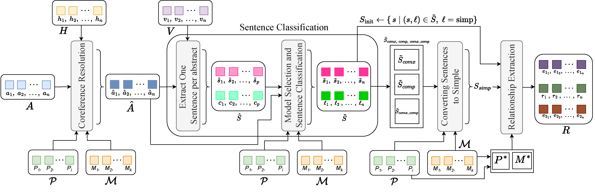

# CoDe-KG

This repository contains the source code and dataset for the following paper:

**Automated Knowledge Graph Construction using Large Language Models and Sentence Complexity Modelling**

*Sydney Anuyah, Mehedi Mahmud Kaushik, Sri Rama Krishna Reddy Dwarampudi, Rakesh Shiradkar, Arjan Durresi, Sunandan Chakraborty*

Published in: Proceedings of the 2025 Conference on Empirical Methods in Natural Language Processing (EMNLP 2025)

[[Paper]](https://aclanthology.org/2025.emnlp-main.783/)

---

## Abstract

CoDe-KG is an open-source, end-to-end pipeline for extracting sentence-level knowledge graphs by combining robust coreference resolution with syntactic sentence decomposition. Using this model, we contribute a dataset of over 150,000 knowledge triples. We also contribute a training corpus of 7,248 rows for sentence complexity, 190 rows of gold human annotations for coreference resolution using open-source lung cancer abstracts from PubMed, 900 rows of gold human annotations for sentence conversion policies, and 398 triples of gold human annotations. We systematically select optimal prompt-model pairs across five complexity categories, showing that hybrid chain-of-thought and few-shot prompting yields up to 99.8% exact-match accuracy on sentence simplification. On relation extraction (RE), our pipeline achieves 65.8% macro-F1 on REBEL, an 8-point gain over the prior state of the art, and 75.7% micro-F1 on WebNLG2, while matching or exceeding performance on Wiki-NRE and CaRB. Ablation studies demonstrate that integrating coreference and decomposition increases recall on rare relations by over 20%.



---

## Table of Contents

1. [Installation](#installation)
2. [Quick Start](#quick-start)
3. [Project Structure](#project-structure)
4. [Usage](#usage)
   - [First-time Run (BERT Training)](#first-time-run-bert-training)
   - [Subsequent Runs (Inference Only)](#subsequent-runs-inference-only)
5. [Pipeline Details](#pipeline-details)
6. [CLI Arguments](#cli-arguments)
7. [Dataset](#dataset)
8. [Citation](#citation)
9. [License](#license)

---

## Installation

1. Clone the repository:

```bash
git clone https://github.com/KaushikMahmud/CoDe-KG_EMNLP_2025.git
cd CoDe-KG_EMNLP_2025
```

2. Create a virtual environment (recommended):

```bash
python -m venv venv
source venv/bin/activate  # On Windows: venv\Scripts\activate
```

3. Install dependencies:

```bash
pip install -r requirements.txt
```

4. Download spaCy language model:

```bash
python -m spacy download en_core_web_sm
```

---

## Quick Start

Process a single abstract and generate knowledge graph triples:

```bash
python run_pipeline.py \
  --abstract "Your abstract text here..." \
  --out_csv kg_triples.csv \
  --bert_out_dir models/bert_sentence_classifier
```

Output will be saved to `kg_triples.csv` with columns: `doc_id`, `sentence`, `entity_1`, `relationship`, `entity_2`.

---

## Project Structure

| File | Description |
|------|-------------|
| `run_pipeline.py` | Main entry point for the pipeline |
| `tokenization_utils.py` | Paper-style tokenization with token indices |
| `coref_module.py` | Coreference resolution with Mixtral + FICL prompts |
| `bert_sentence_classifier.py` | BERT-Large sentence type classifier |
| `simplify_stage.py` | Sentence simplification module |
| `relation_extractor.py` | Triple extraction from simple sentences |
| `prompts.py` | System and user prompts (coref, simplification, RE) |

---

## Usage

### First-time Run (BERT Training)

On the initial run, the BERT classifier must be trained from a labeled CSV file. The training file should contain:

- A text column (e.g., `Sentence`)
- A label column (e.g., `label`)

Supported labels:
- `Simple Sentence`
- `Compound Sentence`
- `Complex Sentence`
- `Compound-Complex Sentence`
- `Incomplete Sentence` (optional)

Execute the following command to train the classifier and run the pipeline:

```bash
nohup python run_pipeline.py \
  --abstract "Your abstract text here..." \
  --out_csv kg_triples.csv \
  --train_bert_if_missing \
  --bert_train_csv train.csv \
  --bert_text_col Sentence \
  --bert_label_col label \
  --bert_out_dir models/bert_sentence_classifier \
> run_pipeline.log 2>&1 &
```

This command performs the following operations:

1. Checks for an existing model at `models/bert_sentence_classifier`
2. If absent, trains BERT-Large on the provided training data
3. Saves the fine-tuned model to the specified directory
4. Executes the full pipeline on the input abstract
5. Writes extracted triples to `kg_triples.csv`

Logs can be monitored with:

```bash
tail -f run_pipeline.log
```

### Subsequent Runs (Inference Only)

Once the BERT classifier has been trained, subsequent runs require only the model path:

```bash
nohup python run_pipeline.py \
  --abstract "Your abstract text here..." \
  --out_csv kg_triples.csv \
  --bert_out_dir models/bert_sentence_classifier \
> run_pipeline.log 2>&1 &
```

---

## Pipeline Details

The pipeline executes the following steps:

### Step 1: Tokenization

The input text is converted to indexed tokens:

```
("This", 0), ("tutorial", 1), ("serves", 2), ...
```

### Step 2: Coreference Resolution

Mixtral with FICL prompts identifies coreferent expressions and produces JSON annotations:

```json
{
  "Expression": "PBC",
  "StartToken": 88,
  "EndToken": 88,
  "RefersTo": "Primary biliary cirrhosis"
}
```

Expressions are replaced with their full referents at the corresponding token indices.

### Step 3: Sentence Splitting

The reconstructed text is split into individual sentences.

### Step 4: Sentence Classification

The fine-tuned BERT-Large model classifies each sentence by structural complexity:

- Simple
- Compound
- Complex
- Compound–Complex

### Step 5: Sentence Simplification

Non-simple sentences are converted to simple sentences using model-specific prompts:

| Sentence Type | Model |
|---------------|-------|
| Simple | Passed through unchanged |
| Compound | LLaMA-3.1-8B |
| Complex | LLaMA-3.3-70B |
| Compound–Complex | Mixtral |

Output format:

```
S1 -> ...
S2 -> ...
S3 -> ...
```

### Step 6: Relation Extraction

Each simple sentence is processed by Mixtral to extract triples:

```json
[
  {
    "Entity 1": "regulating miR-497-5p",
    "Entity 2": "lung cancer targeted treatment",
    "Relationship": "provides"
  }
]
```

### Step 7: CSV Export

All extracted triples are written to the output CSV with the following schema:

| Column | Description |
|--------|-------------|
| `doc_id` | Document identifier |
| `sentence` | Source sentence |
| `entity_1` | First entity |
| `relationship` | Relation type |
| `entity_2` | Second entity |

---

## CLI Arguments

| Argument | Description |
|----------|-------------|
| `--abstract` | Input abstract text to process |
| `--out_csv` | Output path for extracted triples |
| `--train_bert_if_missing` | Train BERT classifier if no model exists |
| `--bert_train_csv` | Path to labeled training CSV |
| `--bert_text_col` | Column name containing sentence text |
| `--bert_label_col` | Column name containing sentence labels |
| `--bert_out_dir` | Directory for saving/loading the BERT model |

---

## Dataset

### Coreference Resolution Dataset

The dataset is provided in JSON format:

```json
{
  "doc_id": "103",
  "annotations": [
    {
      "Expression": "PBC",
      "StartToken": 14,
      "EndToken": 14,
      "RefersTo": "Primary biliary cirrhosis"
    }
  ],
  "new_text": "(\"BACKGROUND:\", 0), (\"There\", 1), ..."
}
```

### Field Descriptions

| Field | Description |
|-------|-------------|
| `doc_id` | Unique document identifier |
| `annotations` | List of coreference annotations |
| `new_text` | Tokenized text with position indices |

### Annotation Schema

| Field | Description |
|-------|-------------|
| `Expression` | Text span referring to an entity |
| `StartToken` | Starting token position (0-indexed) |
| `EndToken` | Ending token position (0-indexed, inclusive) |
| `RefersTo` | Referenced entity or concept |

---

## Citation

If this work is useful for your research, please cite our paper:

```bibtex
@inproceedings{anuyah2025automated,
  title={Automated knowledge graph construction using large language models and sentence complexity modelling},
  author={Anuyah, Sydney and Kaushik, Mehedi Mahmud and Dwarampudi, Sri Rama Krishna Reddy and Shiradkar, Rakesh and Durresi, Arjan and Chakraborty, Sunandan},
  booktitle={Proceedings of the 2025 Conference on Empirical Methods in Natural Language Processing},
  pages={15526--15550},
  year={2025}
}
```

---

## License

This project is licensed under the MIT License. See the [LICENSE](LICENSE) file for details.

---

## Contact

For questions or issues, please contact the authors.
